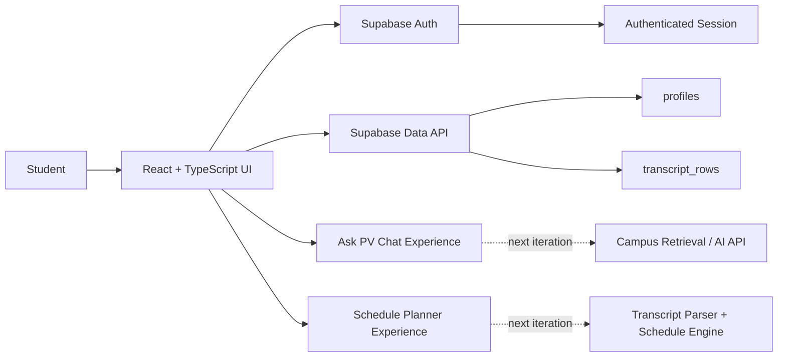

<div align="center">

# Ask PV

### A student-centered campus assistant prototype for Prairie View A&M University

Built to explore one question: **what if students could ask campus questions, manage academic preferences, and plan a semester from one place?**


**Hackathon prototype · Portfolio-maintained by Deja Ware**

</div>

> [!NOTE]
> Ask PV is a student-built hackathon prototype and is **not an official Prairie View A&M University service**. The repository documents both the working integrations and the features that remained prototype concepts at the end of the event.

---

## The idea

College information is spread across catalogs, advising pages, registrar resources, degree requirements, and personal scheduling constraints. Ask PV was designed as a single student-facing experience that could eventually bring those pieces together.

<table>
<tr>
<td width="33%" valign="top">

### Ask
A conversational interface for campus, registration, course, and resource questions with room for citations and direct actions.

</td>
<td width="33%" valign="top">

### Plan
A guided semester-planning flow that captures degree rules, time preferences, modality, and credit targets.

</td>
<td width="33%" valign="top">

### Personalize
Authenticated student profiles persist academic preferences and provide user-controlled data management.

</td>
</tr>
</table>

---

## Prototype status

| Area | Status | What exists in this repository |
| --- | --- | --- |
| Authentication | **Connected** | Supabase email/password sign-up, sign-in, session persistence, and sign-out |
| Student profile | **Connected** | Profile read/update flow backed by Supabase |
| Transcript data controls | **Connected** | User-triggered deletion flow for rows associated with the signed-in user |
| Campus Q&A experience | **Prototype UI** | Chat interface, citations, and action patterns; the current answer is a mocked demo response |
| Schedule planner | **Prototype UI** | Multi-step planning experience and sample schedule options |
| AI / retrieval API | **Next integration** | No external LLM or RAG endpoint is currently wired into the checked-in prototype |
| Automated schedule engine | **Next integration** | Planner logic and transcript parsing still need a backend implementation |

This distinction is intentional: the repo shows **what the hackathon team implemented, what was demonstrated, and what the next engineering iteration would require**.

---

## System architecture



### Current data boundary

The browser uses a **Supabase publishable key**, which is appropriate for client applications when Row Level Security (RLS) is correctly configured. No service-role or elevated backend key is used in the frontend code.

Before a public production deployment, the database policies should be re-verified so each authenticated student can only read or mutate their own records.

---

## Project structure

```text
ask-pv/
├── public/                     # Static browser assets
├── src/
│   ├── components/
│   │   ├── ui/                 # shadcn/Radix UI primitives
│   │   ├── Layout.tsx
│   │   └── NavLink.tsx
│   ├── hooks/                  # Shared React hooks
│   ├── integrations/
│   │   └── supabase/           # Supabase client + generated DB types
│   ├── lib/                    # Shared utilities
│   ├── pages/                  # Ask, Auth, Home, Plan, Profile, 404
│   ├── App.tsx
│   └── main.tsx
├── .env.example
├── components.json
├── tailwind.config.ts
└── vite.config.ts
```

The source tree was restored from the original hackathon upload so the repository now matches the import paths and project configuration the application was designed around.

---

## Core flows

### 1. Authentication

Ask PV uses Supabase Auth for account creation and email/password sign-in. The browser session is persisted and the navigation reacts to authentication state.

### 2. Profile persistence

Authenticated users can load and update academic preferences such as major, catalog year, target credit load, and preferred modality.

### 3. Data management

The profile experience includes a transcript-data deletion action scoped in the client query to the current user's ID. Database RLS remains the required server-side authorization boundary.

### 4. Ask PV interface

The chat experience was designed for sourced answers and quick actions such as opening advising, registrar, or campus-map resources. The current repository uses a demo response while preserving the interface expected by a future retrieval/AI service.

### 5. Schedule planner

The planner captures the intended workflow—transcript input, degree rules, preferences, and schedule results. The current schedule options are sample data; a production iteration would add transcript parsing, catalog rules, conflict detection, and schedule optimization.

---

## Security and repository hygiene

- `.env` files are ignored from source control.
- `.env.example` documents the client configuration without storing live values.
- The frontend expects a **publishable** Supabase key only.
- No service-role key belongs in this client repository.
- User-scoped database operations still require verified RLS policies on the Supabase project.
- Claims in the portfolio documentation are limited to behavior that is present in the codebase.

> [!IMPORTANT]
> A Supabase publishable key is designed to be visible in browser applications. It does **not** replace authorization. RLS policies are what protect rows in exposed tables.

---

## Run locally

### Prerequisites

- Node.js 18+
- npm
- Access to a Supabase project with the expected schema

### Setup

```bash
git clone https://github.com/dware11/hackathon.git
cd hackathon
npm install
cp .env.example .env
npm run dev
```

Then provide the client-side Supabase values in `.env`:

```bash
VITE_SUPABASE_URL=your-project-url
VITE_SUPABASE_PUBLISHABLE_KEY=your-publishable-key
```

### Useful commands

```bash
npm run dev      # local development
npm run build    # production build
npm run lint     # lint the codebase
npm run preview  # preview the production build
```

---

## What I would build next

1. Connect the Ask experience to a server-side campus retrieval / AI endpoint.
2. Ingest trusted PVAMU resources and return traceable citations rather than generated placeholder sources.
3. Add transcript parsing and catalog-rule normalization.
4. Implement an actual conflict-detection and schedule-ranking engine.
5. Verify and test Supabase RLS policies for every user-owned table.
6. Add automated tests for auth, profile persistence, and protected data flows.
7. Replace sample schedule data with generated options and calendar export.

---

## Why this project matters in my portfolio

Ask PV represents the kind of engineering work I enjoy: taking a real user problem, mapping the full experience, connecting authentication and data persistence, and identifying where a prototype needs stronger backend logic before it can become a trustworthy production system.

The hackathon version proved the product direction. This maintained repository focuses on making the implementation, system boundaries, and next engineering decisions understandable to someone seeing the project for the first time.

---

<div align="center">

**Maintained by [Deja Ware](https://github.com/dware11)**

</div>
